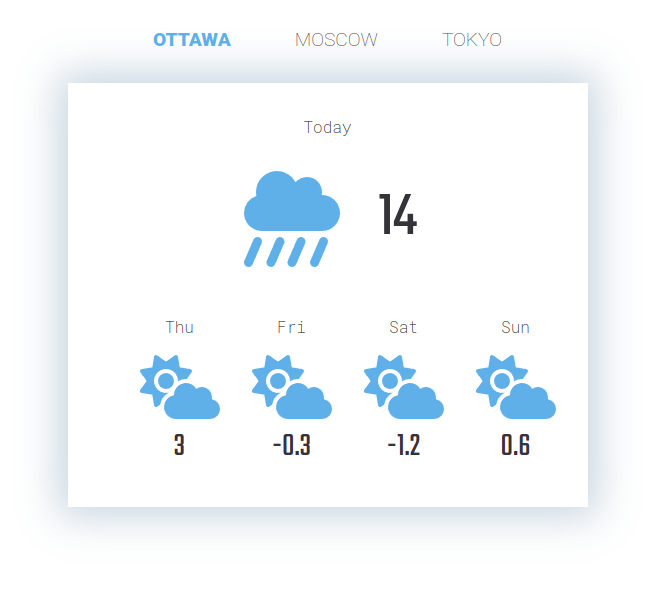

# Weather React App

A simple Weather Application made with [React.js](https://reactjs.org/), CSS modules and Font-Awesome Icons using the [Open-Meteo](https://open-meteo.com) Weather API.

Check the application is live on the following link:

[weather-react](https://weather-react-three.vercel.app/)

<p align="center">
  
</p>

## Requirements

- Node.js
- npm (or yarn or pnpm)

## Development Setup

clone the repository and run the following commands in the project root folder.

```sh
npm install #first time to install dependencies
npm run dev
```
